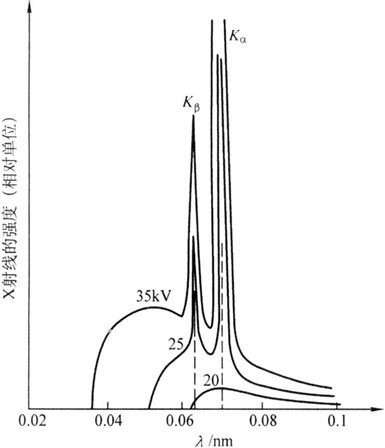

X射线物理学
===========

德国物理学家伦琴发现了X射线，其本质是一种波长介于紫外线和γ射线之间的电磁波，其光量子遵循爱因斯坦关系 :math:`\varepsilon=\hbar\omega,\vec{p}=\hbar\vec{k}` 。

X射线谱
-------

X射线管中阴极灯丝产生的高速电子流撞击金属阳极靶，产生X射线，其中包含两种射线谱。 

	
	（来自 `材料知识中心 <http://111.207.167.154/index.php?doc-view-120701>`_）

连续X射线谱
+++++++++++

高速电子碰撞减速而辐射出的光子，又称轫致辐射。存在短波极限，对应电子动能完全转化为光量子的波长，即 :math:`\lambda_0=\frac{hc}{eU}` 。随着管电压增高，谱线向左上移动。

谱线下包围的面积正比于单位时间连续X射线强度，实验规律有 :math:`I_{连续谱}=\alpha iZU^2` ，其中 α 为常数，Z 为靶材原子序数，i 和 U 为管电流和管电压。由此可算出发射连续谱的效率：

.. math::

	\eta=\frac{\alpha iZU^2}{iU}=\alpha ZU

为提高效率，可采用重元素靶材并提高管电压。 

特征X射线谱
+++++++++++

当管电压超过一定程度，某些特征波长出现窄高的谱线。这是由于内层电子被击出，附近电子向其跃迁发光，因而波长为若干特定值，仅与原子序数有关。则阴极电子动能必须大于等于内层电子逸出功，以 K 层为例 :math:`eU=-E_K=W_K` 

特征谱线波长与原子序数的关系为 :math:`\sqrt{\frac{1}{\lambda}}=K(Z-\sigma)` ，称为 **莫塞莱定律** ，其中 K 与 σ 为常数。

谱线分类： 

.. digraph:: classification

	node[fontname = "Noto Serif CJK SC",fontsize = 12];
	edge[fontname = "Noto Serif CJK SC",fontsize = 12];
	rankdir=LR;
	root[label="谱线"];
	K[label="K系"];
	Kalpha[label="K_α峰"];
	Kalpha1[label="K_α1"];
	root->K[label="跃迁到K层"];
	K->Kalpha[label="来自L层"];
	Kalpha->Kalpha1[label="来自L_III亚层"];
	root->"L系"[label="跃迁到L层"];
	root->"  ···  ";
	K->"K_β峰"[label="来自M层"];
	K->" ··· ";
	Kalpha->"K_α2"[label="来自L_II亚层"]

各谱线强度不同， :math:`K_{\alpha}:K_{\beta}\approx 5:1,K_{\alpha1}:K_{\alpha2}=2:1` ，总的K系谱线强度经验公式：

.. math::

	&I_{特征}=Ai(U-U_K)^R\\
	&U_K为K系临界激发电压，R\approx1.5

X射线与物质相互作用
-------------------

在穿透物质过程中，X射线发生散射和真吸收而衰减。 

X射线的衰减
+++++++++++

衰减规律
^^^^^^^^

.. math::

	&I=I_0 \exp(-\mu_l t) 其中t为物质厚度,\\
	&\mu_l为线吸收系数，与波长和物质种类有关\\
	&质量吸收系数\mu_m=\frac{\mu_l}{\rho}具有加和性\\
	&即对于含多种元素的物质，\mu_m=\sum_{i=1}^n\omega_i\mu_{mi}\\
	&决定因素\mu_m\approx K\lambda^3 Z^3，并且在吸收限处\mu_m突增

具体原理
^^^^^^^^

光子与紧束缚电子碰撞，方向改变而能量不变，产生 **相干散射** ，这是X射线衍射分析的主要信息源。而光子与弱束缚电子碰撞，产生 **非相干散射（康普顿散射）** ，给衍射分析带来不利影响。入射波长越短，被照元素越轻，非相干散射越显著。

X射线光量子能量足够时，会引起受辐射物质的特征辐射，即 **荧光辐射** ，这对于衍射分析不利。能量要求 :math:`W_K=\frac{hc}{\lambda_K}` 。这种情况下X射线能量被大量吸收，产生吸收限 :math:`\lambda_K,\lambda_L,\lambda_M` 。

除荧光辐射外，还会产生一个 K 空位被两个 L 空位取代的 **俄歇效应** ，俄歇电子可带来物质的表层信息。 

吸收限的应用
++++++++++++

在X射线衍射实验中，为了尽可能减少荧光辐射，入射线的波长应略大于或远小于 :math:`\lambda_K` ，换言之，靶材的原子序数应略小于或远大于试样的。

K系特征谱线包含两条，可采用吸收限恰位于 :math:`K_{\alpha}和K_{\beta}` 波长之间的材料制成滤片，可滤除波长较短的 :math:`K_{\beta}` 线，得到单色辐射。
