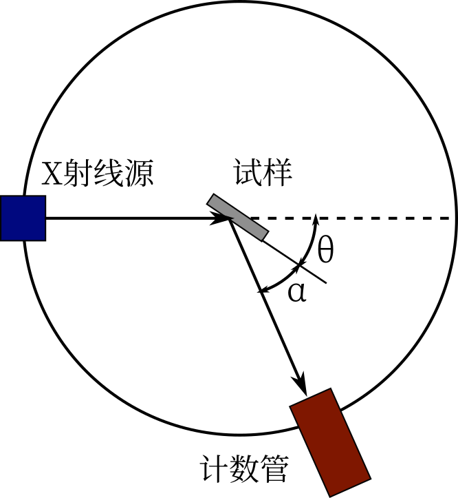

X射线衍射
=========

方向
----

布拉格方程和劳厄方程
++++++++++++++++++++

布拉格方程和劳厄方程，见 `材料物理笔记-衍射条件 <http://material-physics-notes.readthedocs.io/zh_CN/latest/%E6%99%B6%E4%BD%93%E4%B8%AD%E7%9A%84%E8%A1%8D%E5%B0%84.html#id3>`_ 。其中若将 (h k l) 面的 n 级衍射看作虚拟的 (nh nk nl) 面（记为干涉面 (H K L) ）的一级衍射，则布拉格方程简化为 :math:`2d\sin\theta=\lambda` 

对于一定波长的X射线，干涉面间距越小，布拉格角越大，且仅有 :math:`d\ge\frac{\lambda}{2}` 的干涉面能参与衍射。

厄瓦德尔图解和实际测量方法
++++++++++++++++++++++++++

将入射波矢终点置于倒空间原点 :math:`O'` ，确定起点 O，以 O 为圆心，波矢为半径画圆，圆周上的格点均为可能的衍射面 :math:`\vec{K}_{h'}` 。

以不同方法变换入射波矢和晶体的关系，可以将圆周（球面）扩展成面（体），从而得到大量衍射光斑。方法包括： 

- 改变入射波矢方向，可得到以 :math:`O'` 为球心， :math:`2O'O` 为半径的 **极限球**
- **单晶劳埃法** ：改变入射波长，可以得到“大球 - 小球”的形体
- **周转晶体法** ：晶体绕转轴（通常为一已知的主晶轴）旋转，可以得到一个以 :math:`O'` 为中心的圆环
- **多晶体衍射法** ：多晶取向各有不同，可以得到极限球。改变入射波矢方向，其空间指向也不过是几条曲线轨迹，而多晶衍射中，小晶体众多，入射波矢与小晶体的位向关系包罗万象，相当于每个倒格点都绕原点旋转成球面—— **倒易球** 。因而衍射斑不再是点，而是反射球与倒易球的交线——衍射环

强度
----

电子散射强度
++++++++++++

电子受到强度为 :math:`I_0` 的偏振 X 射线作用，在距电子 R，散射方向与入射线 **电场矢量** 夹角为 φ 处，散射波强度：

.. math::
	
	I_e=I_0\left(\frac{e^2}{4\pi\varepsilon_0 m_e c^2 R}\cos \phi\right)^2

考虑到一般入射X射线为非偏振，则仅考虑散射方向与入射线之间的夹角 2ψ： 

.. math::

	I_e=I_0\left(\frac{e^2}{4\pi\varepsilon_0 m_e c^2 R}\right)^2 \frac{1+\cos^2 2\psi}{2}

原子散射强度
++++++++++++

X射线波长与原子半径在同一量级，不能忽视不同电子散射波间的周相差。由于电子距离小于半波长，合成波振幅总小于各散射波振幅代数和，但也不会完全抵消。

:math:`I_a=f^2 I_e` 其中 f 为原子散射因子，与原子种类及 θ、λ 有关。原子序数越大，f 越大； :math:`\frac{\sin \theta}{\lambda}` 越大，f 越小。

f 的计算见 `材料物理笔记-原子散射因子 <http://material-physics-notes.readthedocs.io/zh_CN/latest/%E6%99%B6%E4%BD%93%E4%B8%AD%E7%9A%84%E8%A1%8D%E5%B0%84.html#id4>`_ 。

晶胞散射强度
++++++++++++

体现了复式格子中不同位置原子散射波的干涉，定义 :math:`F(\vec{K})=\sum_j f_j\exp(i\vec{K}\cdot\vec{r}_j),则I_c=|F_{hkl}|^2 I_a` 。由于考虑对称性，均采用晶胞基矢。求和范围包含一个晶胞中的所有原子（例如体心立方中有两个原子）。

则晶面 :math:`(h'\;k'\;l')` 的衍射波强度为： 

.. math::

	\begin{split}
	I_{h'k'l'} &\propto& |F(\vec{K}_{h'k'l'})|^2 = (\mathrm{Re}F)^2+(\mathrm{Im}F)^2\\
	&=& \left[\sum_j f_j\cos 2\pi(h'x_j+k'y_j+l'z_j)\right]^2+\left[\sum_j f_j\sin 2\pi(h'x_j+k'y_j+l'z_j)\right]^2
	\end{split}

由此可以得到不同晶格的消光条件，其中对于四种基本点阵的简单格子： 

+------------+-----------------+-----------------+
| 布拉菲格子 | 出现的衍射      | 消失的衍射      |
+============+=================+=================+
| 简单点阵   | 全部            | 无              |
+------------+-----------------+-----------------+
| 底心点阵   | h、k全奇全偶    | h、k奇偶混杂    |
+------------+-----------------+-----------------+
| 体心点阵   | h+k+l为偶数     | h+k+l为奇数     |
+------------+-----------------+-----------------+
| 面心点阵   | h、k、l全奇全偶 | h、k、l奇偶混杂 |
+------------+-----------------+-----------------+

单个小晶体散射强度
++++++++++++++++++

之前讨论的都是无限大晶体，而单个小晶体是有限的，因此衍射斑形成衍射图样。在严格符合布拉格方程的方向：

.. math::

	&I_b=|A_b|^2=I_c|F_{hkl}|^2|G(\vec{K}_{hkl})|^2\\
	&其中|G(\vec{K}_{hkl})|^2为干涉系数，与晶体大小形态有关

而即使方向有微小偏离， :math:`I_b` 也不会立即降为0。 

反映在倒易点阵上，每个倒格点扩展为一个空间范围，即衍射筹。晶体在某个方向上线度越小，则倒空间此方向扩展的越大。 

实际多晶体的衍射
----------------

由于上述倒格点的扩展，以及亚晶粒、X射线波长范围的影响，衍射环扩展为衍射环带，因此采用积分衍射强度对其表征。考虑到各种各样的因素，多晶体衍射强度的理论公式为： 

.. math::

	I=I_0\frac{\lambda^3}{32\pi R}\left(\frac{e^2}{4\pi\varepsilon_0 mc^2}\right)^2\frac{V}{V_c^2}P_{hkl}|F_{hkl}|^2L_p A e^{-2M}

其中考虑到的因素： 

- :math:`R` 为晶体到射线探测器的距离
- :math:`V` 为多晶体体积，:math:`V_c` 为晶胞体积；这是考虑到晶体中参与衍射的晶粒数
- :math:`P_{hkl}` 为多重因子；这是考虑到同一晶面族的倒格点会融为同一个倒易球
- :math:`L_p=\frac{1+\cos^2 2\theta}{\sin^2\theta\cos\theta}` 为洛伦兹偏振因子；这是考虑到测量的是单位面积积分强度而非衍射环带总积分强度
- :math:`A` 为吸收因子；这是考虑到试样对射线的吸收
- :math:`e^{-2M}` 为温度因子；这是考虑到分子热运动会破坏点阵的严格对称性

实际工作中，通常只需要了解各衍射线相对强度。在同一谱线中，略去所有常数，得 

.. math::

	I=\frac{V}{V_c^2}P_{hkl}|F_{hkl}|^2L_p A e^{-2M}

X射线衍射方法
-------------

曾经普遍使用照相法，现在一般使用衍射仪，包含测角仪、计数器和单色器三部分。 

照相法
++++++

- 德拜-谢乐法：使用单色 X 光源照射圆柱状多晶试样，用环绕式样的窄条状底片接收。 **优点** ：试样量少，记录衍射角范围宽，误差分析简单，精度高。 **缺点** ：衍射强度低，曝光时间长。
- 聚焦法：使用圆周上的具有一定发散的单色 X 光源照射圆周上的弧形多晶试样表面，根据圆周角相等，相同晶面族产生的衍射线聚焦于一点。若衍射角为 θ，则光源与聚焦点之间的弧所对的圆心角为 4θ。 **优点** ：曝光时间短，分辨率高。 **缺点** ：角度范围小。
  
测角仪
++++++

	测角仪

衍射角是射线与衍射面的夹角；而入射角（射线与样品表面的夹角）则决定了射线的穿透深度，在表面分析中要着重控制。 

- 耦合扫描方式： :math:`\alpha=\theta` ，这样发生衍射的永远是平行于试样表面的晶面（由于晶粒方向各异，所有位向的晶面有可能衍射）。可以同步旋转试样和计数器（θ/2θ 耦合扫描）或者同步旋转射线源和计数器（θ/θ 耦合扫描），这样 λ 不变，改变 θ，可以使不同的 d 满足布拉格方程，从而使各种晶面发生衍射。事实上由于试样并非弧面，衍射线略有发散，可以接受。
- 非耦合扫描方式：没有耦合转动。可以仅旋转式样（α 扫描）或仅旋转计数器（2θ 扫描）。
  
  - α 扫描：衍射角不变，因而发生衍射的是不同空间取向的同族晶面，用于判断晶粒取向的不均匀性。
  - 2θ 扫描：入射角不变，衍射角变化，可以在不改变穿透深度的条件下测得不同晶面的衍射。
    
计数器
++++++

- 闪烁计数器：X 射线激发磷光体发出荧光，通过光电倍增管放大后，利用光电管进行测量。 **优点** ：响应速度快。 **缺点** ：背景脉冲高，受温度影响大。
- 正比计数器：X 射线激发施加一定电压的惰性气体电离，产生的电子引发连锁反应，最终形成可测的电流。 **优点** ：脉冲与吸收光子能量成正比，性能稳定，分辨率高。 **缺点** ：对温度敏感，计数器电压需高度稳定。

单色器
++++++

为了滤除连续辐射以及 :math:`k_{\beta}` 线，可以使用之前提到的滤波片，为追求更高精度，也可使用晶体单色器。

晶体单色器： 使衍射光照射到一块弧形单晶，再次衍射后进入计数器。保持衍射光对单晶的衍射角，由于是单晶，衍射面间距也固定，则只有固定波长的衍射光能再次衍射。

一般使用波高分析器配合滤波片或晶体单色器：脉冲波高正比于 X 射线能量，通过滤除过高或过低的脉冲来增强单色性。 

测量影响因素
++++++++++++

- 试样：块状试样应避免织构，粉末试样粒径应小
- 管电压与管电流：管电压影响较复杂，存在峰值；辐射强度与管电流成正比，一般调节电流
- 狭缝：发散角度过大会照射到试样架；接收狭缝角度大，衍射强度提高但分辨率下降
- 扫描速度：过大时导致强度和分辨率下降，衍射峰迁移
  
