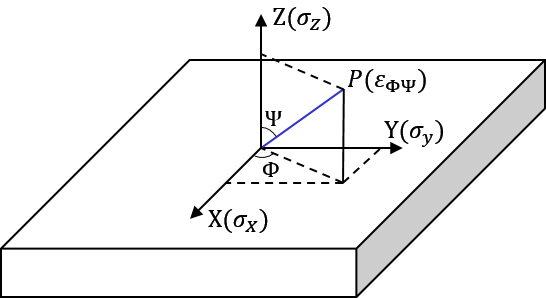

X射线衍射分析
=============

定性物相分析
------------

标准卡片 PDF
++++++++++++

标准卡片上记载了晶体的： 

- 晶系、空间群、晶格常数
- 光学性质、颜色、其他一些物理性质
- 来源、制备方式
- 衍射面间距、相对衍射峰强度（以最强为100）、晶面指数； **三个最强的被特别标出**
- 实验条件

索引方法
++++++++

- :math:`d` 比 :math:`I` 重要。相比衍射强度，晶面间距的数据更为准确而不易受影响，因此可以根据最强的三个衍射峰对应的晶面间距进行检索。
- 低角比高角重要。低角很少出现重叠线。
- 强线比弱线重要。
- 可能出现线缺失、重叠线。

实际上检索系统综合运用了多种算法。 

定量物相分析
------------

对于多相混合物中的某一相，衍射强度为： 

.. math::

	\begin{split}
	&I_j=\frac{1}{2\bar{\mu}_l}\left[\frac{V f_j}{V_c^2}P|F|^2L_pe^{-2M}\right]_j\\
	&其中f_j为体积分数，\bar{\mu}_l为试样总体的线吸收系数\\
	&设与f_j无关的部分C_j=\left[\frac{V}{V_c^2}P|F|^2L_pe^{-2M}\right]_j\\
	&则I_j=\frac{C_j f_j}{\bar{\mu}_l}=\frac{C_j f_j}{\rho\bar{\mu}_m}=\frac{C_j \omega_j}{\rho_j\bar{\mu}_m}\\
	&其中质量分数\omega_j满足\sum_{j=1}^n \omega_j=1
	\end{split}

一般而言， :math:`\bar{\mu}_m` 随 :math:`f_j` 变化，因而 :math:`I_j` 与 :math:`f_j` 并非线性关系。

直接对比法
++++++++++

对于试样中的 n 种相，各取一根不重叠的衍射钱，以其中一相作为参考（第一相）。则各相强度可表示为： 

.. math::

	\begin{split}
	&f_j=\frac{C_1 I_j}{C_j I_1}f_1\\
	&结合之前的关系，可知 f_j=\frac{\frac{C_1 I_j}{C_j I_1}}{\sum_{j=1}^n\frac{C_1 I_j}{C_j I_1}}
	\end{split}

这样只要确定各物相的 :math:`\frac{C_1}{C_j}` 和 :math:`\frac{I_j}{I_1}` ，就可以确定体积分数。例如测定钢中残余奥氏体的含量：

.. math::

	f_{\gamma}=\frac{1}{1+\frac{C_{\gamma}I_{\alpha}}{C_{\alpha}I_{\gamma}}}

点阵结构分析
------------

可以根据 :math:`I\sim\theta` 曲线计算出点阵常数。对于立方晶系：

.. math::

	\begin{split}
	&a=\frac{\lambda}{2\sin \theta}\sqrt{H^2+K^2+L^2}\\
	&其中(H\ K\ L)为衍射面指数
	\end{split}

误差分析
++++++++

实际上会存在很多误差。包括： 

- 测角仪引起的误差： :math:`2\theta` 的 0° 误差、 :math:`2\theta` 刻度误差、试样表面离轴误差、入射线垂直发散误差
- 试样引起的误差：试样平面性误差、试样晶粒大小误差、试样透明度误差
- 其他误差：角因子偏差、定峰误差、温度变化误差、X射线折射误差、特征辐射非单色误差    

对晶面间距 :math:`d` 取全微分： 

.. math::

	\frac{\Delta d}{d}=\frac{\Delta\lambda}{\lambda}-\frac{\Delta\theta\cos\theta}{\sin\theta}

为了减小误差（即 :math:`|\frac{\Delta d}{d}|` ），应从以下方面入手： 

- 减小 :math:`\Delta\lambda\ \to` 改进X射线源
- 增大 :math:`\lambda\ \to` 使用轻元素作为X射线管靶材，同时会降低分辨率
- 减小 :math:`\Delta \theta\ \to` 改进测角仪
- 增大 :math:`\theta` ，接近 90° 时能消除多种误差 :math:`\to` 选取适当的实验数据

计算方法
++++++++

- 外推法：可以先对每一个衍射峰求出 :math:`d` ，进而求出晶格常数 :math:`a` 。对于立方晶系，由于 :math:`\frac{a-a_0}{a_0}\propto\cos^2\theta` ，取 :math:`\theta>60^\circ` 时的 :math:`(\cos^2\theta,a)` 样本点拟合，其纵截距（即 :math:`2\theta=180^\circ` 时）即为 :math:`a_0` 。对于更低角度的数据，可采用 :math:`(\cos^2\theta(\frac{1}{\sin\theta}+\frac{1}{\theta}),a)` 样本点拟合的方式。
- 内标法：利用已知的内标样品（一般是 :math:`Si` 或 :math:`SiO_2` ），根据 :math:`d_{hkl}\sin\theta_{hkl}=d_s\sin\theta_s` 计算，之后根据 :math:`d_{hkl}` 直接计算 :math:`a` 。
- 线对法：利用同一次测量所得到的两根衍射线的线位差值计算点阵参数。

内应力测量分析
--------------

由于不均匀塑性变形，使材料内部仍存在并且自身保持平衡的弹性应力称为内应力。其会对材料的疲劳强度、尺寸稳定性带来不利影响；某些情况下，材料表面的压应力会提高表面疲劳强度。

内应力分类
++++++++++

+--------+--------------+-------------------------------------------------------------------+--------------+
| 类别   | 应力平衡范围 | 特点                                                              | 衍射峰变化   |
+========+==============+===================================================================+==============+
| 第Ⅰ类  | 宏观         | 各晶粒内应力相近；不同取向的同族晶面，平行应力方向 :math:`d` 减小 | 位置移动     |
+--------+--------------+-------------------------------------------------------------------+--------------+
| 第Ⅱ类  | 微观（晶粒） | 晶粒受力不一；相同取向的同族晶面 :math:`d` 也不同                 | 宽化（矮化） |
+--------+--------------+-------------------------------------------------------------------+--------------+
| 第Ⅲ类  | 微观（晶胞） | 原子偏离平衡位置，衍射整体减弱                                    | 整体减弱     |
+--------+--------------+-------------------------------------------------------------------+--------------+

宏观内应力计算
++++++++++++++

X射线衍射光仅能穿透表面，因而测得的是平面应力状态。设定好X方向后，对于同一族晶面，在不同的 :math:`\Phi,\Psi` 下测量其衍射角 :math:`\theta` 。可得出法向为 :math:`OP` 方向的晶面，其应变为：

.. math::

	\begin{split}
	&实验测量：\varepsilon_{\Phi\Psi}=\frac{d_{\Phi\Psi}-d_0}{d_0}=-\frac{\pi}{180^\circ}(\theta_{\Phi\Psi}-\theta_0)\cot\theta_0\\
	&胡克定律：\varepsilon_{\Phi\Psi}=\frac{1+\nu}{E}(\sigma_x\cos^2\Phi+\tau_{xy}\sin2\Phi+\sigma_y\sin^2\Phi)-\frac{\nu}{E}(\sigma_x+\sigma_y)
	\end{split}

其中E为弹性模量； :math:`\nu` 为泊松比； :math:`\theta_0` 为无应力时该晶面族的衍射角。令二者相等，在 :math:`\Phi` 为0°、90°及45°时，推出应力表达式： 

.. math::

	\begin{split}
	&\sigma_x=K\frac{\partial2\theta_{\Phi=0}}{\partial\sin^2\Psi},\quad
	\sigma_y=K\frac{\partial2\theta_{\Phi=90}}{\partial\sin^2\Psi}\\
	&\tau_{xy}=K\frac{\partial2\theta_{\Phi=45}}{\partial\sin^2\Psi}-\frac{1}{2}(\sigma_x+\sigma_y)\\
	&其中应力常数K=-\frac{E}{2(1+\nu)}\frac{\pi}{180^\circ}\cot\theta_0
	\end{split}

包含 :math:`\theta_0` 的 :math:`K` 严格来说与晶面有关，可以根据材料查取，材料未知则只能实验测量。实际应用中一般是对于固定 :math:`\Phi` 的 :math:`(\sin^2\Psi,2\theta)` 样本点进行拟合得到所需的偏导数，最少需要两个点，例如0°~45°法：

.. math:: \frac{\partial2\theta_{\Phi_1}}{\partial\sin^2\Psi}=2(2\theta_{\Psi=45}-2\theta_{\Psi=0})

测量方法
++++++++

有两种方法，侧倾法较好。 

- 同倾法： :math:`\Psi` 平面与扫描仪 :math:`2\theta` 扫描平面重合，即试样表面法线、入射线、出射线共面。此法 :math:`\Psi` 角设置受限。又分为两种：

  - 固定 :math:`\Psi_0` 法：一次扫描中，入射角 :math:`\Psi_0` 不变，改变 :math:`\theta` 进行扫描， :math:`\Psi=\Psi_0+90^\circ-\theta` 
  - 固定 :math:`\Psi` 法：一次扫描中，确定衍射面法向，即 :math:`\Psi_0` 不变，改变 :math:`\theta` 进行扫描

- 侧倾法： :math:`\Psi` 平面与扫描仪 :math:`2\theta` 扫描平面垂直。这样不必考虑吸收因子的影响； :math:`\Psi` 角设置不受限，几何对称性好。

误差因素
++++++++

- 试样要求：

  - 组织结构：无粗晶、无织构
  - 表面处理：光滑、无氧化层。可能需要腐蚀预处理去除附加应力层。就是要测量表面应力则要保护好表面。

- 衍射波长与衍射晶面：应尽量使用高角衍射，保证 :math:`\theta` 较大。
- 定峰方法：半高宽中点定峰法，顶部抛物线定峰法，衍射峰重心定峰法。
- 应力常数：晶体弹性模量具有各向异性，若使用平均弹性模量会带来误差，应根据晶面查取。

微观内应力与谱线宽化
++++++++++++++++++++

仪器因素和材料因素都会导致谱线宽化，即观测到的峰的半高宽 :math:`\beta_o=\beta_i+\beta_r` 。若已知仪器因素，则应力和晶粒尺寸因素 :math:`\beta_r=\beta_o-\beta_i` （洛伦兹理论）或 :math:`\beta_r^2=\beta_o^2-\beta_i^2` （高斯理论）。

而在理论上，尺寸因素 :math:`\beta_p=\frac{k\lambda}{D\cos\theta}` ，其中 :math:`k=0.89\sim1.39` 取决于晶粒形状， :math:`D` 为晶粒尺寸；应力因素 :math:`\beta_s=4\varepsilon\tan\theta` ，其中 :math:`\varepsilon` 为显微畸变值。

:math:`\beta_r=\beta_p+\beta_s` ，则 :math:`\beta_r\cos\theta=\frac{k\lambda}{D}+4\varepsilon\sin\theta` 。画出 :math:`\beta_r\cos\theta,\sin\theta` 图拟合，斜率即为 :math:`4\varepsilon` 。
