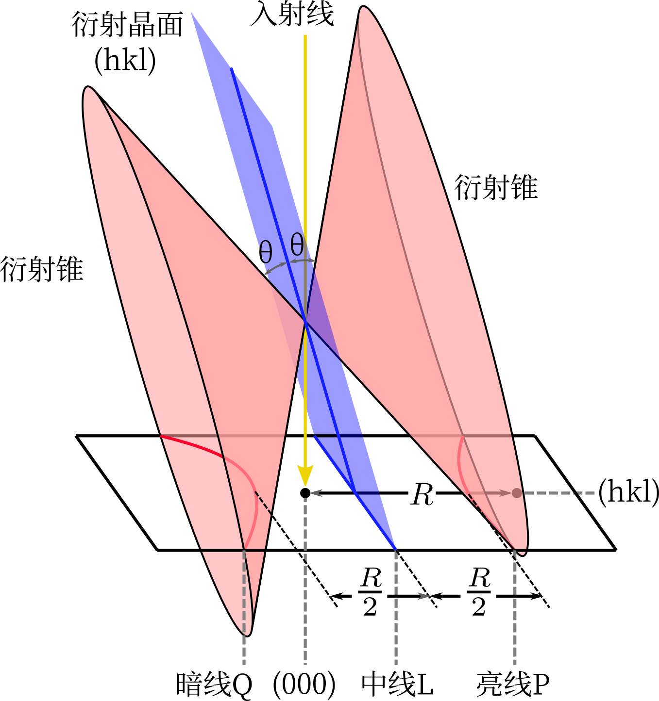

电子衍射成像
============

与X射线衍射的差异： 

- 受原子核散射
- 衍射角很小
- 衍射强度很大
- 作用体积很小
  
衍射条件
--------

薄样品衍射畴沿厚度方向拉伸呈杆状，而厄瓦尔德球半径又很大，则只有几乎垂直于入射波方向 :math:`[u~v~w]` 的零层倒易面 :math:`(u~v~w)_0^*` 上、原点附近的倒易点可发生衍射。这对应着以 :math:`[u~v~w]` 为晶带轴的晶带（即满足 :math:`hu+kv+lw=0` 的晶面）。用劳厄方程的方式表示为 :math:`\vec{k}'-\vec{k}=\vec{g}+\vec{s}` ，其中 :math:`\vec{s}` 偏量起点为倒易点，终点为厄瓦尔德球面，平行于 :math:`\vec{k}` 。入射方向的少许偏离（即衍射角 :math:`\theta` 的少许变化）不会改变衍射斑点排布，只会改变亮度。

设衍射斑点与透射斑点距离为 :math:`R` ，底片与样品的距离为 :math:`L` ，则相机常数为 :math:`K=\lambda L` ，由布拉格公式可得 :math:`Rd=K` ，进一步写成矢量式 :math:`\vec{R}=K\vec{g}` 。也就是说，衍射斑点的 :math:`\vec{R}` 是产生这一斑点的倒格矢 :math:`\vec{g}` 的比例放大，两个衍射斑点坐标的夹角也就是对应晶面的夹角。

选区电子衍射
------------

在电子显微镜中，有物镜、中间镜、投影镜，有效相机长度 :math:`L'=f_0M_iM_p`，即物镜焦距、中间镜放大倍数、投影镜放大倍数之积。衍射光为平行光，经物镜会聚后成像于物镜背焦面，样品像成像于像平面。通过改变中间镜励磁电流，使其物平面与物镜背焦面、像平面重合，即为衍射模式、成像模式。衍射斑点中心为明亮的透射斑。

选区光阑位于物镜相平面，在成像模式下调节选区光阑，使视野中仅有微区 :math:`\Omega` ；换到衍射模式，则仅有微区 :math:`\Omega` 衍射形成的斑点。以用此方法可观察多晶中某一区域的衍射斑点。

由于电磁透镜的作用，会出现磁转角。 

多晶衍射花样
------------

可得到一系列衍射环，根据 :math:`\vec{R}=K\vec{g}` 可计算出晶面间距。另外，衍射环半径平方之比为整数：

:math:`R_1^2:R_2^2:\cdots R_j^2=`

- :math:`1:2:3:4:5:6:8:9\cdots` 简单立方
- :math:`1:2:3:4:5:6:7:8\cdots` 体心立方
- :math:`3:4:8:11:12\cdots` 面心立方  

影响多晶衍射环的因素：参与衍射的晶粒数、织构。 

可用于标定相机常数、大量弥散粒子物相鉴定。 

单晶衍射花样
------------

几何特征与强度
++++++++++++++

衍射花样就是零层倒易面的放大像，而各斑点强度明显不同。 

标定方法
++++++++

尝试校核法： 

- 选择离透射斑最近而不在同一直线上的几个斑点，测出 :math:`R_A,R_B,R_C\cdots,\langle R_A,R_B\rangle,\langle R_A,R_C\rangle\cdots`
- 根据 :math:`R^2` 比值确定晶体结构
- 根据晶体结构可确定各倒格点对应晶面族，为 :math:`A` 任选一个晶面，可根据 :math:`\langle R_A,R_B\rangle` 得出 :math:`B` 对应的晶面
- 以 :math:`A,B` 为基得出其他点的晶面指数，由此可推出 :math:`R_C\cdots` ，与实际测量值进行比较
- 用两个衍射斑点的晶面指数即可确定晶带周
  
  .. math:: u:v:w=\left|\begin{matrix}k_1 & l_1\\k_2 & l_2\end{matrix}\right|:\left|\begin{matrix}l_1 & h_1\\l_2 & h_2\end{matrix}\right|:\left|\begin{matrix}h_1 & k_1\\h_2 & k_2\end{matrix}\right|

还可使用标准花样对照法，将照片与根据晶带定理和相应晶体点阵的消光规律绘出的、各种晶体点阵主要晶带的倒易截面的、理论图像比较。在拍摄时应尽量使电子束对称入射。

应用
++++

- 物相分析：可以测出多个 :math:`R` ，进而计算出 :math:`d` ，对比标准卡片
- 析出相与母相的位向关系分析：强斑点组对应母相，弱斑点组对应析出相
- 析出相惯习面的确定：要结合透射像

复杂衍射花样
------------

高阶劳厄区斑点
++++++++++++++

厄瓦尔德球也会与高层倒易面接触，形成环状高阶劳厄区。扩展的晶带定律： :math:`hu+kv+lw=N` ，其中 :math:`N=0,\pm1,\pm2\cdots` ，称为 :math:`N` 阶劳厄带。

高阶劳厄斑反映晶体三维结构信息。 

超点阵斑点
++++++++++

一些斑点在无序固溶体中消光，而在有序固溶体或金属间化合物中会出现（强度较弱）。 

孪晶衍射花样
++++++++++++

孪晶表现为两套衍射斑点，当电子束平行孪晶面入射时，两套衍射斑关于孪晶面对应的倒格矢对称。FCC孪晶面为 :math:`\{1~1~1\}` 晶面族，BCC孪晶面为 :math:`\{1~1~2\}` 晶面族。

二次衍射斑点
++++++++++++

动力学现象，衍射束若较强，还可以在其他晶面发生衍射，出现二次衍射斑。FCC、BCC中，二次衍射斑与一次重合，而其他晶体中会出现附加斑点。甚至在不同相之间也会出现二次衍射。

菊池线
++++++

入射电子在样品中不仅发生弹性散射，也有非弹性散射，此时能量有损失，散射角越大，能量越小。因而入射束在平行晶面间散射，产生了一对双曲线——菊池线。 :math:`\theta` 为衍射角，距透射斑较近的为暗线，距透射斑较远的为亮线。如上图，菊池线对间距等于 :math:`(h~k~l)` 倒格矢的长度。

根据入射束与衍射晶面的位置关系，两条线可以在透射斑的两侧或同侧。当入射束在衍射晶面内时，两条线亮度相等，实际上在其间出现暗带，称为菊池带。多对菊池线的交点为菊池极，是晶带轴的投影点。由 :math:`[0~0~1],[0~1~1],[1~1~1]` 三个极点为顶点的单位极射投影三角形标准花样，称为菊池图。根据菊池图与菊池花样可确定入射电子束位向。

当样品倾转时，衍射斑仅有亮度的变化，而菊池线对出现明显位移。 