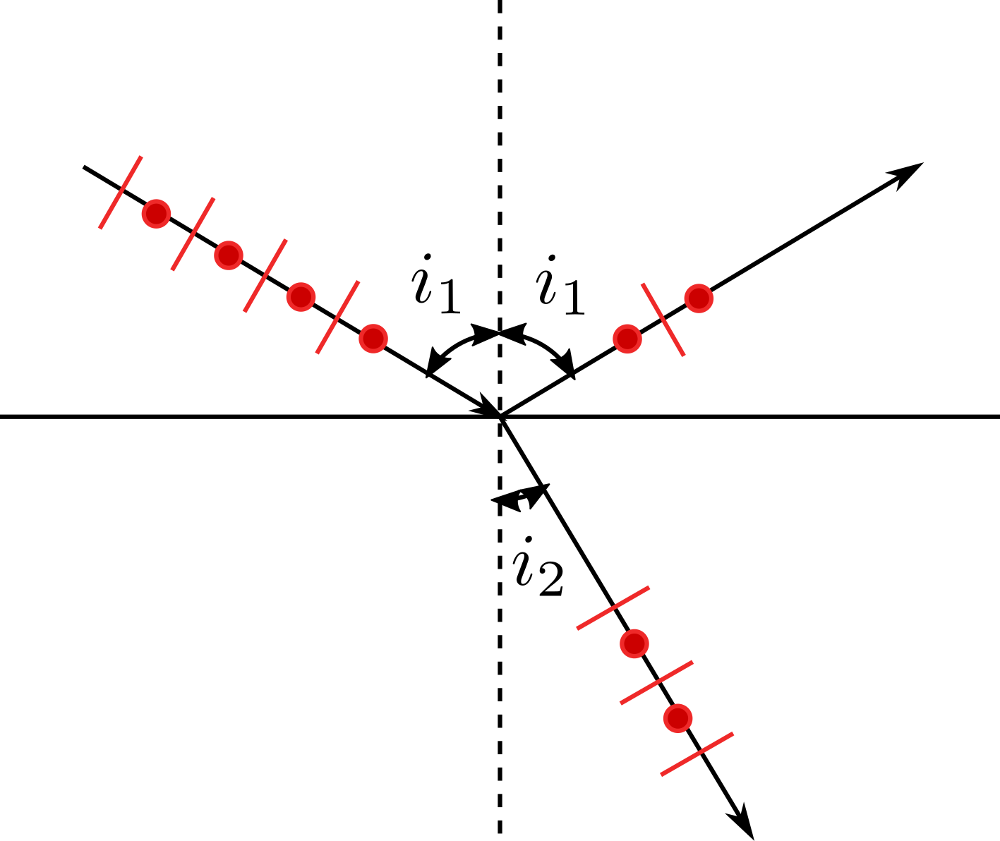

金相显微术
==========

光学基础
--------

反射与折射
++++++++++

反射角等于入射角，折射角服从折射定律： 

.. math::

	\begin{split}
	&\frac{\sin i_1}{\sin i_2}=\frac{v_1}{v_2}=\frac{n_2}{n_1}=n_{12}\\
	&其中折射率 n=\frac{c}{v}
	\end{split}

反过来，当光由光密介质射向光疏介质，若 :math:`\sin i_2\ge\frac{n_1}{n_2}=\frac{v_2}{v_1}` 时，发生全反射。

偏振光
++++++

在某一时刻，自然光中包含各个振动方向的光，而偏振光仅有一个振动方向，其中线偏振光振动方向始终不变，椭圆偏振光振动方向不断旋转。线偏振光在通过检偏器时强度衰减： :math:`I=I_0\cos^2\theta` ，其中 :math:`\theta` 为偏振方向与光栅方向夹角。

如上图所示，振动方向在反射平面内的光反射较少，折射较多，当 :math:`\tan i_1=\frac{n_2}{n_1}=n_{12}` ，即 :math:`i_1+i_2=\frac{\pi}{2}` 时，完全消除，反射光为振动方向垂直于反射平面的线偏振光。该角度称为布儒斯特角。

光学各向异性的晶体具有光轴，当光线入射后分解成两束偏振光：满足折射定律的O光和不满足的E光。可以利用这一原理制成尼克尔双折射棱镜，获取线偏振光。

其他
++++

波长越长，在介质中波速越大，折射率越小。 

显示器中只有红绿蓝三个波长的发光单元，通过改变其强度，人脑能将其辨认为不同的颜色，但这与波长决定的色彩是有区别的。 

人眼明视距离25cm，最小分辨距离0.2mm。 

显微光学系统
------------

透镜
++++

单透镜成像满足 :math:`\frac{1}{a}+\frac{1}{b}=\frac{1}{f}` ，其中 :math:`a,b,f` 分别为物距、像距、焦距。

显微镜的分辨率取决于物镜， :math:`\Delta r_0=\frac{0.612\lambda}{n\sin\alpha}` 越小越好，其中 :math:`\alpha` 为物镜孔径半角， :math:`\mathrm{NA}=n\sin\alpha` 称为数值孔径，代表了镜头的集光能力。因此可采用蓝光、油浸物镜、物镜靠近试样等方法。

放大倍率 :math:`M` 为物镜目镜之积，但对于人眼，有效放大倍率 :math:`M_{\mathit{eff}}=\frac{0.2\mathrm{mm}}{\Delta r_0}` 。

深度方向上的分辨率表现为景深： :math:`D_f=\frac{(0.15\sim0.30)n}{(\mathrm{NA})M}(\mu m)` 。可见景深与分辨率、放大倍率相矛盾。

透镜光学缺陷包括： 

- 在轴像差：色差、球差
- 离轴像差：彗差、像散
- 畸变：场曲

照明系统
++++++++

+----------+--------------+------------+------------+--------------------------------------+
| 类别     | 光源要求     | 照明光类型 | 最后共轭面 | 优点                                 |
+==========+==============+============+============+======================================+
| 临界照明 | 均匀光源     | 汇聚光     | 视网膜     | 设置简便                             |
+----------+--------------+------------+------------+--------------------------------------+
| 科勒照明 | 可用灯丝灯泡 | 平行光     | 瞳孔       | 灯丝像不会出现在视网膜上，明亮，均匀 |
+----------+--------------+------------+------------+--------------------------------------+

光阑
++++

- 孔径光阑：减小可提高衬度；影响分辨率和亮度，但不能用来调节亮度
- 视域光阑：控制可视范围

试样制备
--------

取样和镶嵌
++++++++++

取样应使样品留下的残余损伤最小。常用砂轮切割、电火花切割，后者损伤较小。 

镶嵌可采用多种塑料，如酚醛树脂、丙烯酸树脂、环氧树脂（耐热）。 

磨制和抛光
++++++++++

目的是去除损伤层，得到表面光滑平整的磨面，显示材料真实组织。 

磨制要注意每次研磨与上次研磨方向垂直。 

抛光可采用机械抛光或电解抛光。电解抛光利用了试样凸起部分优先溶解的原理，具有多种优点：无损伤变形层；抛光速度快；表面光整无磨痕。

浸蚀
++++

目的是使式样组织显示出来，常用方法： 

- 化学浸蚀法：硝酸酒精溶液，用于碳钢，浸蚀晶界；苛性钠苦味酸水溶液，用于碳钢，将渗碳体染黑；苛性钠水溶液，用于铝。
- 电解浸蚀：装置和操作与电解抛光相同，只是电压较低。
- 着色显示：例如Klemm浸蚀剂，在不同相表面形成厚度不同的氧化膜，通过薄膜干涉呈现出不同颜色。

常见光学显微镜
--------------

衬度定义为光强差与背景光强之比，即 :math:`\frac{\Delta I}{I_B}` 。如果两种相反射率近似，则衬度不足，分辨率足够也无法分辨，因此发展了各种将相位、偏振差异转变为振幅差，提高衬度的方法。

+------------------+----------------+-----------------------------------------------------------------------------+--------------------+
| 类型             | 作用           | 原理                                                                        | 效果               |
+==================+================+=============================================================================+====================+
| 暗场显微镜       | 观察凹凸区域   | 使空心管状光束以很大的角度照射到试样上                                      | 平整区暗，凹凸区亮 |
+------------------+----------------+-----------------------------------------------------------------------------+--------------------+
| 相位衬度显微镜   | 观察相位变化   || 将直射波 :math:`\mathbf{S}` 移相( :math:`\pm \frac{\pi}{2}` )、减幅，使之与|| 存在相位差的区域衬|
|                  |                || 散射波 :math:`\mathbf{D}` 平行、幅值接近，发生干涉。要使用特制相位板。     || 度增加            |
+------------------+----------------+-----------------------------------------------------------------------------+--------------------+
| 偏振光显微镜     | 观察各向异性   || 起偏器和检偏器光轴正交，则透过光强满足 :math:`I=I_0\cos^2\theta` ，变偏振角|| 转动载物台时，各向|
|                  |                || 为振幅差。                                                                 || 异性相明暗变化    |
+------------------+----------------+-----------------------------------------------------------------------------+--------------------+
| 微分干涉显微镜   | 观察相位梯度   || 起偏器和检偏器光轴正交；利用双折射将入射光分为两束，若通过试样后           |                    |
|                  |                || 二者有光程差，则合成椭圆偏振光，部分透过检偏器，否则无法透过。             |                    |
+------------------+----------------+-----------------------------------------------------------------------------+--------------------+

**共聚焦扫描显微镜** 是一种利用空间针孔过滤掉非焦平面光线，从而提高图像对比度；并利用三维扫描方式获得试样三维形貌的光学显微技术。接收器前的针孔光阑越小，分辨率越高。无法真正成像，需要依靠接收器在计算机中重建图象。
