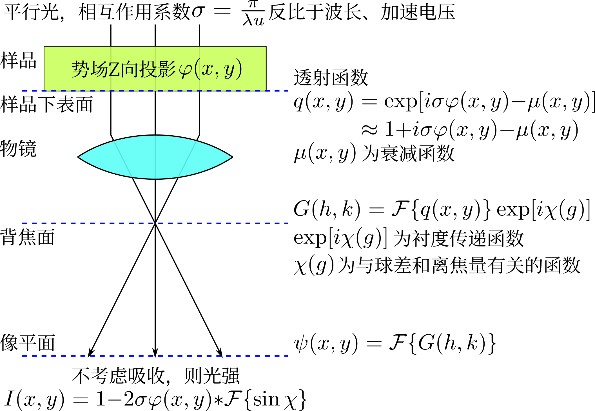

高分辨电镜
==========

基于相位衬度原理，电子在背焦面形成衍射花样，透射束和衍射束在像平面干涉成像（反映点阵势场）。 

成像原理
--------

平面波入射后受晶体势场调制，振幅和相位出现差异。试样很薄时，认为振幅不变，成为纯相位体。则像平面的像相当于晶体势场经过两次傅立叶变换：

其中傅立叶变换为 

.. math:: F(\omega)=\frac{1}{\sqrt{2\pi}}\int_{-\infty}^{+\infty}f(t)e^{-i\omega t}\mathrm{d}t

卷积定义为 

.. math:: f*g\triangleq\int_{-\infty}^{+\infty}f(\tau)g(x-\tau)\mathrm{d}\tau

可见成像反映晶体势场，但受 :math:`\sin\chi` 干扰。 

谢尔策欠焦
++++++++++

考察 :math:`\vec{g}\sim\sin\chi` 曲线，在一定的正离焦量（欠焦）条件下， :math:`\sin\chi\approx-1` 处有一个较宽的平台，此时可得到清晰、不失真的像，这种状态即谢尔策欠焦。平台右端的 :math:`\vec{g}` 所对应的晶面间距即为此时的分辨能力。提高加速电压，可以扩大平台范围。

直接解释
++++++++

在电子束方向上重原子列势较大，像强度弱。 

若在衍射模式下选中透射斑和一个衍射斑（也可包含与之对称的衍射斑），则高分辨像为一维条纹像，也就是衍射斑对应的晶面像。可以衍衬暗场像也无法揭示出的微小亚晶。若选中透射斑和多个衍射斑，则为二维条纹像。这些都是结构相，而非晶格像。

非晶衍射像 FFT 之后显示的是 :math:`\sin\chi` ，通过观察中心亮斑的大小可以将系统调至谢尔策欠焦状态。

随着离焦量、样品厚度变化，高分辨像上的斑点明暗会变化乃至反转。 

应用
----

- 观察位错：电子束应平行于位错线、垂直于柏氏矢量，因而只能显示出位错的刃分量。在高分辨像上可通过构建柏氏回路确定柏氏矢量。
- 观察孪晶
- 观察层错

会聚束电子衍射（CBED）
----------------------

入射束以倒锥形照射样品，选区尺寸可远小于选区电子衍射。此时衍射斑扩展为衍射盘，当会聚角小于某晶面布拉格角时，得到衍射盘不重叠的 K-M 花样。由于小选区内样品基本无塑性变形，且弹性散射电子也参与进来，衍射花样中有明锐的菊池线。

利用 CBED 精确测定点阵常数的方法：模拟不同点阵常数晶体在某确定加速电压下的高阶劳厄菊池花样，将其与实际拍摄的高阶劳厄菊池花样相比较。

电子能量损失谱
--------------

入射电子因碰撞而损失能量，将发生能量损失的电子按能量的大小展开就是电子能量损失谱。其与 X 射线发射谱互补。根据所激发的电子层级，可分为 K、L 电离损失峰等等。

电子能量损失谱仪主要决定于电子源的能量发散度。 

电子能量损失谱的结构： 

- 零损失峰（小于0.1eV）：仅受到原子核弹性散射和声子非弹性散射的电子，能量损失很小，峰强度最大。峰的半高宽定义为谱线的能量分辨率。
- 低能损失区（小于50eV）：入射电子与价电子交互，又名等离子损失峰。
- 高能损失区（大于50eV）：入射电子与内层电子交互，峰强度很小。损失峰的左端能量为损失边，可据此定性、定量的标定元素。从损失峰能量以下的一部分为能量损失近边结构，反映了原子费米能级以上未占有态密度分布；损失峰以上数百电子伏为广延精细结构，反映了物质中配位原子数及相邻原子间距等近邻原子结构信息。